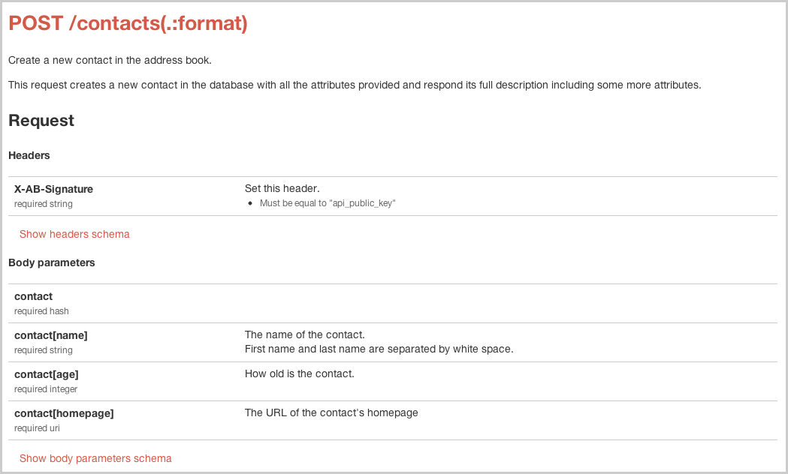
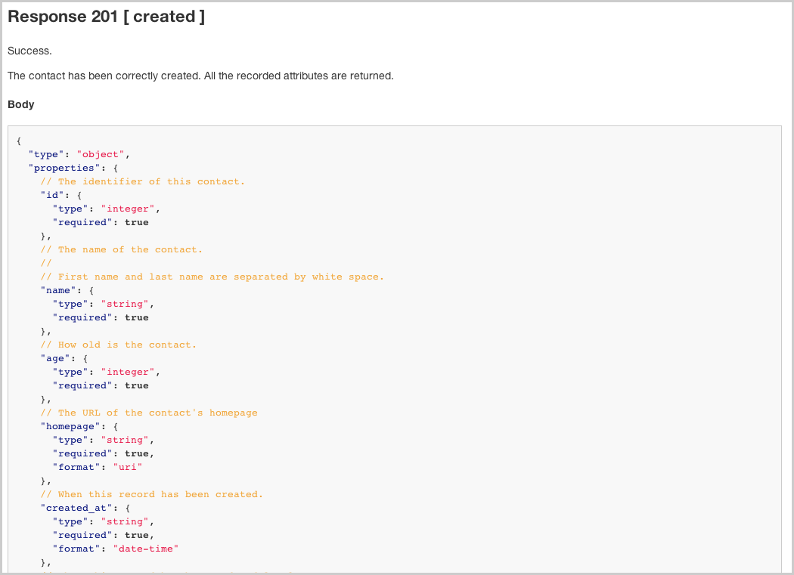

# Respect plugin for Rails

_Respect for Rails_ let's you write the documentation of your REST API using Ruby code. Your app's
API is published using a Rails engine so it is always deployed along with your application and stay
synchronized. A filter is available so you can also easily validate requests and responses. Thanks
to that your incoming parameters will also be sanitized so if you expect a URI in a parameter value you will get a URI object instead of a string object containing a URI.
It follows Rails DRY principle and save you a lot of typing since it
fetches most of the information automatically by inspecting your routes, their constraints and your
model validators. You can always adjust the default by defining the schema per resource and/or
controller.

# Features

* A compact DSL from to the [Respect](https://github.com/nicolasdespres/respect) gem to specify your REST API documentation.
* Filters to automatically validates and sanitize incoming parameters.
* A Rails engine to serve your public REST API documentation.

See the RELEASE_NOTES file for detailed feature listing.

# Take a tour

This section guides for a walk around the main features available.

## Document an action request

_Respect for Rails_ let's you easily describe the structure of incoming requests and outgoing responses
using a simple and compact Ruby DSL. Assuming you have the scaffold of a `ContactsController`, the structure
for its `create` action may look like this:

```ruby
# in app/controllers/contacts_controller_schema.rb
# POST /contacts
# POST /contacts.json
def_action_schema :create do |a|
  a.documentation "Create a new contact in the address book."
  a.request do |r|
    r.body_parameters do |s|
      # They look like something like that:
      #   { contact: { name: "Albert", age: 62, homepage: "http://example.org" } }
      s.hash "contact" do |s|
        s.string "name", doc: "The name of the contact."
        s.integer "age", doc: "How old is the contact."
        s.uri "homepage", doc: "The URL of the contact's homepage"
      end
    end
  end
end
def create
  # ...
end
```

Note that we distinguish from where the parameters comes from (path, query or body) for the sake of documentation.
To see the generated doc, you must mount the provided engine like this:

```ruby
# in config/routes.rb
mount Respect::Rails::Engine => "/rest_spec"
```

and point your favorite web browser to `http://localhost:3000/rest_spec`. You should see something like that



## Document an action response

When documenting an API it is also important to write how the response will look like. You can add this code
to specify the body of the response when the status is "created":

```ruby
# in app/controllers/contacts_controller_schema.rb
# in def_action_schema :create block
a.response_for do |status|
  status.created do |r|
    r.body do |s|
      s.integer name, greather_than: 0, doc: "The identifier of this contact."
      s.string "name", doc: "The name of the contact."
      s.integer "age", doc: "How old is the contact."
      s.uri "homepage", doc: "The URL of the contact's homepage"
      s.datetime "created_at", doc: "When this record has been created."
      s.datetime "updated_at", doc: "When this record has been updated lastly."
    end
  end
end
```

The generated documentation would look like that:



The specification standard used to document schema is defined at [json-schema.org](http://json-schema.org/)
(we currenly follow [draft v3](http://tools.ietf.org/id/draft-zyp-json-schema-03.html)).

## Factor specification code

As you have probably noticed there is some repetition in this code. To avoid it you can create an helper
like this:

```ruby
# in app/helpers/respect/application_macros.rb
module Respect
  module ApplicationMacros
    def id(name = "id")
      integer name, greather_than: 0
    end

    def contact_attributes
      string "name", doc: "The name of the contact."
      integer "age", doc: "How old is the contact."
      uri "homepage", doc: "The URL of the contact's homepage"
    end

    def contact
      id
      contact_attributes
      record_timestamps
    end

    def record_timestamps
      doc "When this record has been created."
      datetime "created_at"
      doc "When this record has been updated lastly."
      datetime "updated_at"
    end
  end
end
```

Notice that we have also provided a macro for the usual +id+ attribute. This helper must be install in the
schema definition DSL like that:

```ruby
# in config/initializers/respect.rb
Respect::Rails.setup do |config|
  config.helpers Respect::ApplicationMacros
end
```

Now the request schema can be rewritten like this:

```ruby
r.body_parameters do |s|
  s.hash "contact" do |s|
    s.contact_attributes
  end
end
```

and the response schema like that:

```ruby
r.body do |s|
  s.hash "contact" do |s|
    s.contact
  end
end
```

## Validate requests and response

All the information you have included in the action specification can also be used to drive a
validation process. To enable it you just have to install an "around" filter in your
`ApplicationController` like this:

```ruby
around_filter :validate_schemas!
```

Responses formatted in JSON are validated only in development and test mode.
When validation failed an exception is raised. To help you debug, we provide a more specific
view than the usual exception reporting view of Rails. You can install this view by adding the
following line to your `ApplicationController`:

```ruby
rescue_from_request_validation_error if Rails.env.development?
```

## Sanitize your incoming parameters

Incoming requests parameters must often be sanitized since they come from un-trusted users.
A sanitized version of the request parameters is built along the validation process and stored
in the `request` object. We can access it using `request.sane_params`. Sanitized object of a
more specific type than the original parameter value. For instance the `homepage` parameter
will be a `URI` object instead of a simple string:

```ruby
request.sane_params[:contact][:homepage].class  #=> URI::Generic
```

You can also automatically sanitize the request parameters *in-place* by installing this before
filter:

``` ruby
before_filter :sanitize_params!
```

## Headers documentation

Often REST API expect headers to be set in the request and/or set headers in their responses.
_Respect for Rails_ let's you document using the `headers` command available for both
the request and the response.

```ruby
a.request do |r|
  r.headers do |h|
    h.doc "Set this header."
    h['X-AB-Signature'] = "api_public_key"
  end
end
```

## Documentation string

The DSL let you write documentation string at many places. All this string are structured with a title
on the first line followed by an empty line and a description for the rest of the string. It is much
like git commit message except that if there is only one paragraph the title will be omit. You can set
the documentation like this of most of the item using the `doc` statement or the `:doc` option when
available. See this example:

```ruby
doc <<-EOS.strip_heredoc
  The name of the contact.

  First name and last name are separated by white space.
  EOS
string "name"

doc "How old is the contact."
integer "age"

uri "homepage", doc: "The URL of the contact's homepage"
```

# Example

There is an example in this repository. To have a look at it:

```
$ git clone git@github.com:nicolasdespres/respect-rails.git
$ cd respect-rails/examples/address_book
$ bundle install
$ rake db:create
$ rake db:migrate
$ rails server
```

Point your favorite web browser to `http://localhost:3000`.

# Getting started

The easiest way to install _Respect for Rails_ is to add it to your `Gemfile`:

```ruby
gem "respect-rails", require: "respect/rails"
```

Then, after running the `bundle install` command, you can mount the Rails engine provided by this library
by adding this line at the beginning of your `config/routes.rb` file.

```ruby
mount Respect::Rails::Engine => "/rest_spec"
```

Then, you can start your application web server as usual at point your web browser to
`http://localhost:3000/rest_spec/doc`.

# Getting help

The easiest way to get help about how to use this library is to post your question on the
[Respect for Rails discussion group](https://groups.google.com/forum/#!forum/ruby-respect-gem-talk).
I will be glade to answer. I may have already answered the
same question so before, you post your question take a bit of time to search the group.

You can also read these documents for further documentation:

* [Respect project](https://github.com/nicolasdespres/respect)
* [Repect API reference documentation](http://nicolasdespres.github.io/respect/)
* [Repect for Rails API reference documentation](http://nicolasdespres.github.io/respect-rails)
* The FAQ file.

# Compatibility

_Respect for Rails_ has been tested with:

* Ruby 1.9.3-p392 (should be compatible with all 1.9.x family)
* Rails 3.2.13
* Respect 0.1.0

Note that it uses `ActiveSupport::JSON` to encode/decode JSON objects.

# Feedback

I would love to hear what you think about this library. Feel free to post any comments/remarks on the
[Respect for Rails discussion group](https://groups.google.com/forum/#!forum/ruby-respect-gem-talk).

# Contributing patches

I spent quite a lot of time writing this gem but there is still a lot of work to do. Whether it
is a bug-fix, a new feature, some code re-factoring, or documentation clarification, I will be
glade to merge your pull request on GitHub. You just have to create a branch from `master` and
send me a pull request.

# License

_Respect for Rails_ is released under the term of the [MIT License](http://opensource.org/licenses/MIT).
Copyright (c) 2013 Nicolas Despres.
